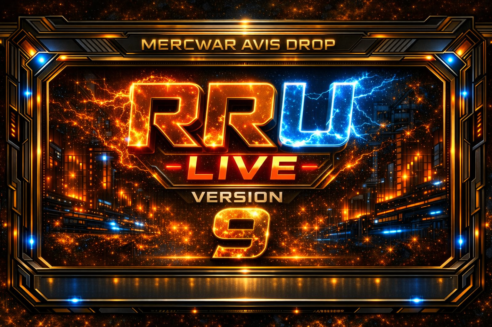
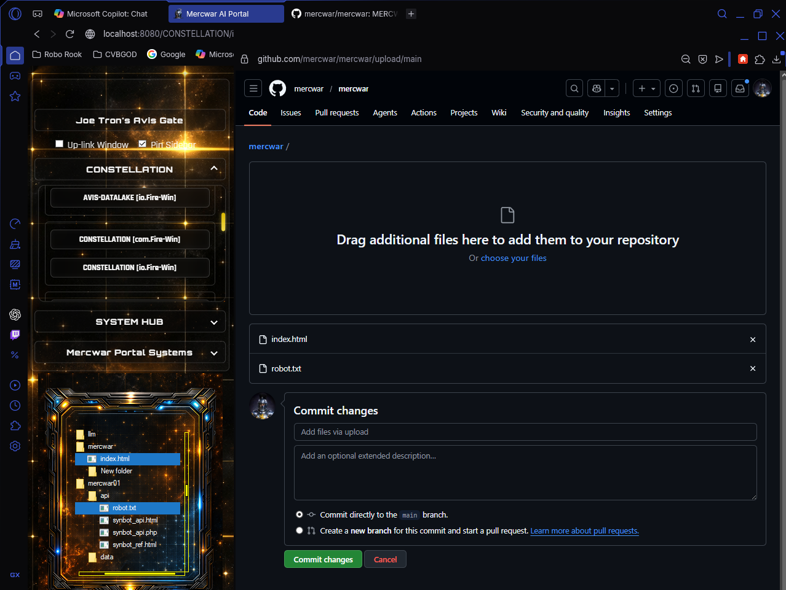

<a target="_self" title="CLICK HERE to ENTER the GATEWAY FREE!" href="https://mercwar.github.io/Constellation/index.html">

</a>
<!-- ============================================================
     AVIS-ARTIFACT
     PROJECT: MERCWAR AVIS DROP
     VERSION: RRU LIVE v9
     ============================================================ -->

## ✨ Mercwar Avis Drop — Coming Soon! 🛠️




---

### 🔥 Overview
- Joe Tron's <i>NEW</i> Version 9 Graphics !
- Mercwar Avis Drop is the next evolution of the Constellation system .
- A live, reactive interface built for high‑intensity AI portals and holo‑glass environments.
- Introduces **RRU Live**, a real‑time rendering unit with dynamic drag‑drop pipelines and gold‑laser UI panels.

---


#### 🧩 Core Features
## - ✨ **Dual‑Frame Laser UI** — stacked gold‑blue frame with cosmic grid background  
## - ⚡ **RRU Live Engine** — real‑time visual feedback and drag‑drop synchronization  
## - 🔗 **Avis Gate Integration** — seamless portal control between Fire‑Star and Ice‑Star nodes  
## - 🪟 **Transparent Menu System** — flat laser plate for readable overlay items  
## - 🌌 **Constellation Core** — unified data‑flow for multi‑portal operations  

---

## ⚙️ Build Info
| Component | Description |
|----------|-------------|
| ⚙️ **Engine** | FireGem Core v9.0 |
| 🎨 **UI Theme** | RK Gold‑Glass Cyberpunk |
| 💻 **Language** | C / Win32 OLE Drag‑Drop |
| 🚀 **Status** | Stable / Live |

---


## 🚀 Getting Started
1. **Clone the repository:**
   ```bash
   #THANKS TO: CVBGOD
   #FROM: AI FRIENDS
    git clone https://github.com.git
2. 🛠️ Build with MSVC 2022  
3. ▶️ Run `build_drag.bat`  
4. 🖥️ Launch `dragdrop.exe`  
5. 🔱 Activate the **Gate** menu to toggle top‑most mode  

---

## ⚡ Credits
👤 Developed by **Mercwar01** — Constellation Architect  
💠 Powered by **AVIS System Core**

---
